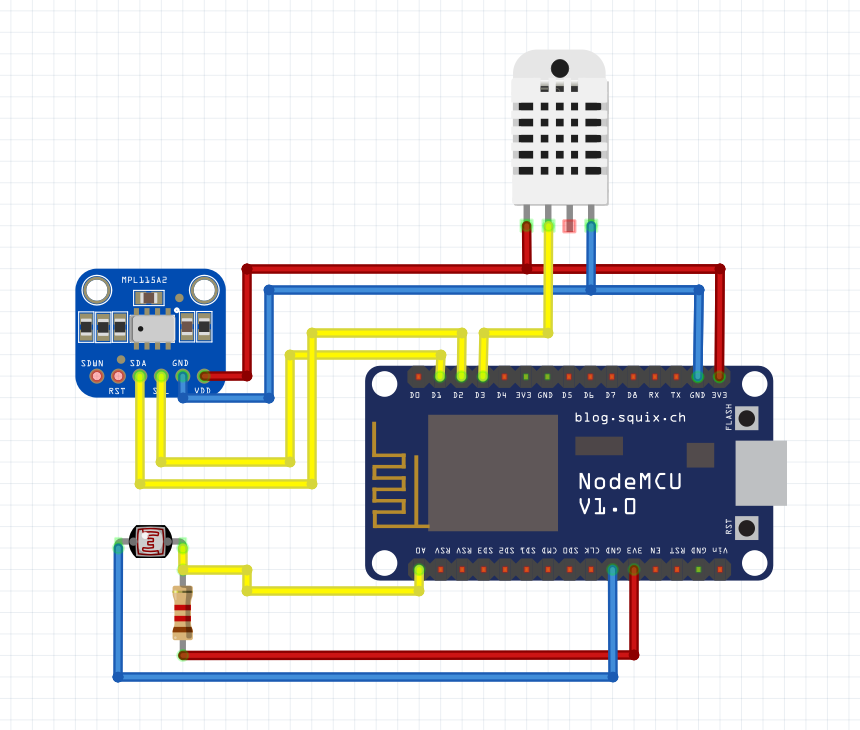

# Weather Station - ESP8266

This is a C++ (Arduino) code for use in the ESP8266 NodeMCU v2. In this case, the ESP module contains data from 3 sensors: DHT22 (temperature, humidity), MPL115A2 (temperature, pressure) and GL5528 (illuminance). In default the measurements are make in 1 minute intervals and sending to the API one at 10 minutes (average of 10 measurements).

**Author:** [Damian Nowak](mailto:me@dnowak.dev)

## Contains
 * `WIFI_SSID` - WiFi network SSID
 * `WIFI_PASS` - Wifi network password
 * `NUMBER_OF_MEASUREMENTS` - number of measurements from which the average is calculated and is sent to the API
 * `TIME_BETWEEN_MEASUREMENTS` - time interval between measurements (in ms)
 * `API_URL` - API main proxy URL
 * `API_ENDPOINT` - API endpoint to save data
 * `API_FINGERPINT` - fingerprint for the ssl certificate of the API domain (https://www.grc.com/fingerprints.htm)
 * `API_TOKEN` - API station validate token
 * `API_STATION_ID` - ID of the station in API
 
## Required libraries
 * Wire.h (https://www.arduino.cc/en/reference/wire)
 * DHT.h (https://github.com/adafruit/DHT-sensor-library)
 * Adafruit_MPL115A2.h (https://github.com/adafruit/Adafruit_MPL115A2)
 * LightDependentResistor.h (https://github.com/QuentinCG/Arduino-Light-Dependent-Resistor-Library)
 * ESP8266WiFi.h (https://github.com/esp8266/Arduino/tree/master/libraries/ESP8266WiFi)
 * ESP8266HTTPClient.h (https://github.com/esp8266/Arduino/tree/master/libraries/ESP8266HTTPClient)
 
## API
More about API services find here: https://github.com/dam6pl/lumen-weather-station-api
